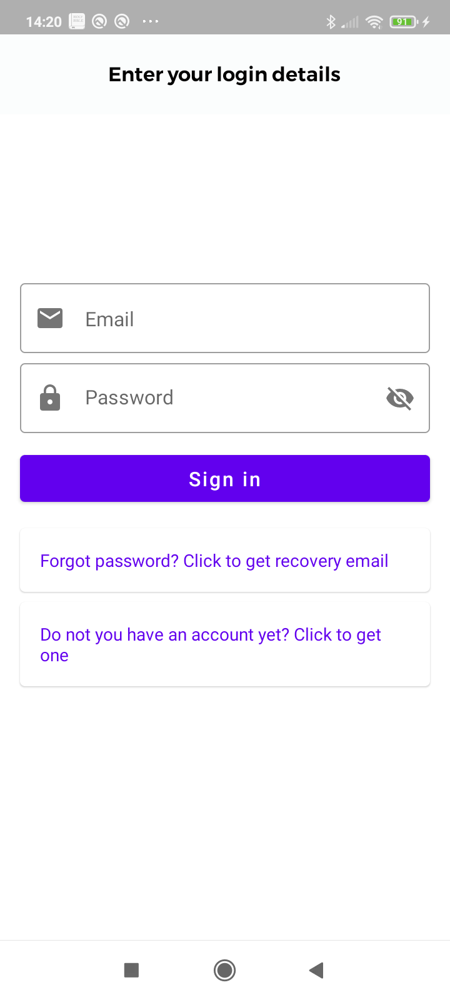

# Firebase Chat

This is a simple chat application using [Firebase](https://firebase.google.com/) as its backend.

The App has implemented all its features such authentication, push notifications, and firestore
database with [Firebase].

The architecture used is the recommended by 

🧬 Screenshots
------------

| Project | |
|:-----|---------|
|   </img>    A sample blog post viewer that demonstrates the use of Compose with a typical Material app and real-world architecture.    • Medium complexity • Varied UI • Light & dark themes • Resource loading • UI Testing    **[> Browse](JetNews/)**   |  |
|  |  |
|   </img>   A sample chat app that focuses on UI state patterns and text input.  • Low complexity • Material Design 3 theme and Material You dynamic color • Resource loading • Back button handling • Integration with Architecture Components: Navigation, Fragments, LiveData, ViewModel • Animation • UI Testing  **[> Browse](Jetchat/)**    | |
|  |  |
|  </img>   A sample survey app that showcases text input, validation and UI state management in Compose.  • Low complexity • `TextField` and form validation • Snackbar implementation • Element reusability and styling • Various form elements   **[> Browse](Jetsurvey/)**    |  |
|  |  |
|  </img>   Jetsnack is a sample snack ordering app built with Compose.  • Medium complexity • Custom design system • Custom layouts • Animation  **[> Browse](Jetsnack/)**     | |
|  |  |
|  </img>   A sample podcast app that features a full-featured, Redux-style architecture and showcases dynamic themes.  • Advanced sample • Dynamic theming using podcast artwork • Image fetching • [`WindowInsets`](https://developer.android.com/reference/kotlin/android/view/WindowInsets) support • Coroutines • Local storage with Room  **[> Browse](Jetcaster/)**     | |
|  |  |
|  </img>    A Compose implementation of the Rally Material study, a financial app that focuses on data, charts, reusability and animations.  • Low complexity • Material theming with a dark-only theme • Custom layouts and reusable elements • Charts and tables • Animations • Screenshot tests  **[> Browse](Rally/)**     | |
|  |  |
|  </img>    A Compose implementation of the Crane Material study, a travel app that uses Material Design components and Material Theming to create a personalized, on-brand experience.  • Medium complexity • Draggable UI elements • UI state handling • UI Tests  **[> Browse](Crane/)**     | |
|  |  |
|  </img>    A Compose implementation of the Owl Material study. The Owl brand uses bold color, shape, and typography to express its brand attributes: energy, daring, and fun.  • Medium complexity • Material theming & light/dark themes • Custom layout • Animation  **[> Browse](Owl/)**     | |
|  |  |
|  </img>    A compose implementation of the Reply material study, an email client app that focuses on adaptive design for mobile, tablets and foldables. It also showcases brand new Material design 3 theming, dynamic colors and navigation components.  • Medium complexity • Adaptive UI for phones, tablet and desktops • Foldable support • Material 3 theming & Components • Dynamic colors and Light/Dark theme support  **[> Browse](Reply/)**     | |

--- 

  If you have any feedback or problem, <a href="mailto:help@rviewer.io">let us know!</a> 🤘
    
  Made with ❤️ by <a href="https://rviewer.io">Rviewer</a>

