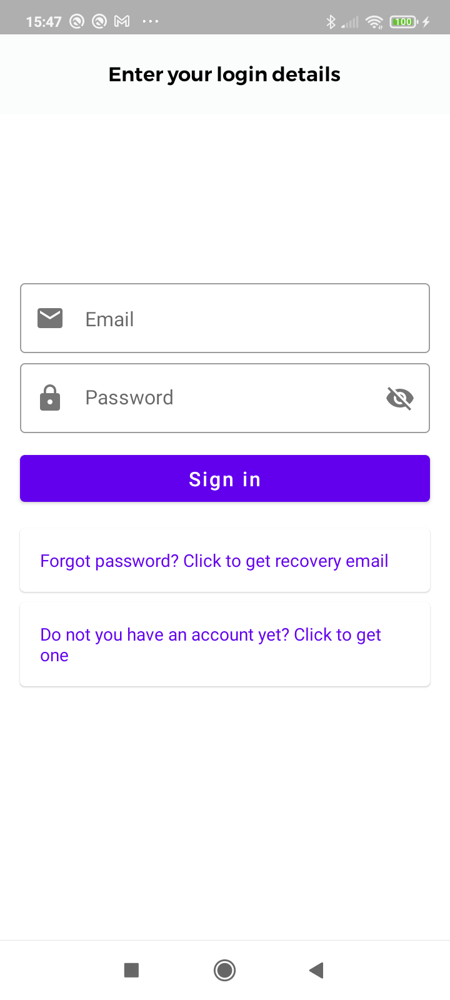

# Firebase Chat

This is a simple chat application using [Firebase](https://firebase.google.com/) as its backend.

The App has implemented all its features such authentication, push notifications, and firestore
database with [Firebase] without backend ;)

The architecture used is the recommended by google in the guide to app architecture.
  

The UI has been designed using compose completly and navigation component, the project has been decoupled 
in two large layers UI and Model.

Has been implemented the dependency inversion principle to make the code well decoupled from other layers.
Also I tried to follow the SOLID principles to make the project easier to understand and modify or extend in the future.

🧬 Screenshots
------------

| Login | Dashboard | ChatRoom |
|     |  |      |

--- 

🧬 To improve
------------
 * Achieve 100% of coverage of testing
 * Implement Koin as dependency injection framework
 * Migrate the bussiness logic to a Kotin Multiplatform Library

--- 